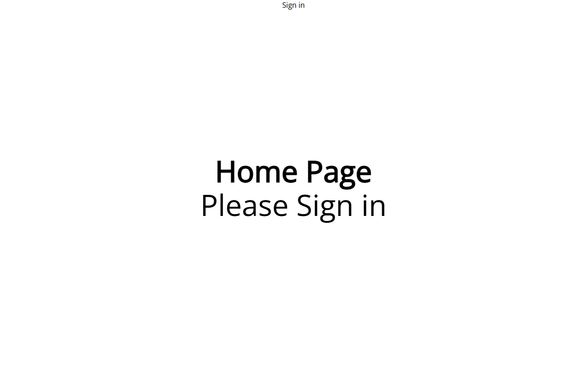

# ◈ CodeFlow — Full-Stack Project Management App

<div align="center">


**Kanban-Style Project Management with JWT Auth Simulation**

[Live Demo](https://codeflow.vercel.app) · [View Code](https://github.com/Amrit004/codeflow)

</div>



---

A fully functional Kanban-style project management application with JWT authentication simulation, real data persistence via `localStorage`, drag-and-drop, and an activity audit log. Built with vanilla HTML, CSS, and JavaScript — no frameworks, no build tools.

## 🚀 Features

| Feature | Description |
|---------|-------------|
| **Authentication** | Login/Register with form validation, JWT simulation, auto-login (1hr expiry) |
| **Kanban Board** | 4 columns (To Do → In Progress → In Review → Done) with drag-and-drop |
| **Task Management** | Create, edit, delete tasks via modal with priority, tags, due dates, assignees |
| **Search & Filter** | Real-time search by title/tags, priority filter (Critical/High/Medium/Low) |
| **Backlog View** | Table view of all tasks with direct row editing |
| **Activity Log** | Persistent audit trail of all actions (last 50 events) |
| **Projects** | Multiple projects with colour-coded sidebar and per-project isolation |
| **Settings** | Update profile, clear all data |

## 🧰 Architecture Highlights

### JWT Authentication Flow
```
Register → Hash password → Store in localStorage
         → createToken() → Base64(header.payload.sig)
         → Store token → parseToken() on reload
         → isTokenValid() → auto-login if valid
```

### Data Layer (localStorage persistence)
```javascript
DB.get('tasks', [])   // → parse JSON from localStorage
DB.set('tasks', data) // → JSON.stringify and persist
DB.del('tasks')       // → localStorage.removeItem
```

## 📂 Project Structure

```
codeflow/
├── index.html        # Auth screen + full app shell
├── css/
│   └── style.css     # Auth, sidebar, Kanban, modal, all components
├── js/
│   └── app.js        # Auth, JWT, data layer, board, activity, settings
└── README.md
```

## ⚡ Quick Start

```bash
git clone https://github.com/Amrit004/codeflow.git
cd codeflow
open index.html   # No server required
```

Try the **Demo Account** button to load pre-seeded data.

---

<div align="center">

**Built by Amritpal Singh Kaur**

[LinkedIn](https://linkedin.com/in/amritpal-singh-kaur-b54b9a1b1) · [GitHub](https://github.com/Amrit004) · [Portfolio](https://apsk-dev.vercel.app)

</div>
